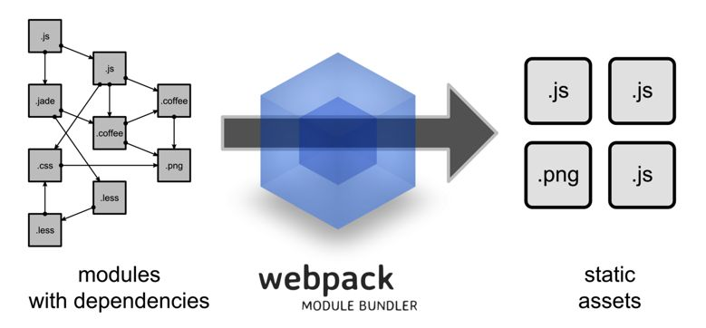

# 1.什么是WebPack
WebPack可以看做是模块打包机：它做的事情是，分析你的项目结构，找到JavaScript模块以及其它的一些浏览器不能直接运行的扩展语言（Scss, TypeScript等），并将其打包为合适的格式以供浏览器使用。



构建就是把源代码转换成发布到线上的可执行JavaScript、CSS、HTML代码，包括如下内容。

- 代码转换：TypeScript编译成JavaScript、SCSS编译成CSS等。
- 文件优化：压缩JavaScript、CSS、HTML代码，压缩合并图片等。
- 代码分割：提取多个页面的公共代码、提取首屏不需要执行部分的代码让其异步加载。
- 代码分割：提取多个页面的公共代码、提取首屏不需要执行部分的代码让其异步加载。
- 模块合并: 在采用模块化的项目里会有很多模块和文件，需要构建功能把模块分类合并成一个文件。
- 自动刷新：监听本地源代码的变化，自动重新构建、刷新浏览器。
- 代码校验：在代码被提交到仓库前需要校验代码是否符合规范，以及单元测试是否通过。
- 自动发布：更新完代码后，自动构建出线上发布代码并传输给发布系统。

构建其实是工程化、自动化思想在前端开发中的体现，把一系列流程用代码去实现，让代码自动化地执行这一系列复杂的流程。构建给前端开发注入了更大的活力，解放了我们的生产力。

# 2.初始化项目
```js
mkdir zhufeng-webpack
cd zhufeng-webpack
npm iniit -y
```

# 3.快速上手
## 3.1 webpack核心概念
- Entry: 入口，Webpack执行构建的第一步将从Entry开始，可抽象成输入。
- Module: 模块，在Webpack里一切皆模块，一个模块对应着一个文件。Webpack会从配置的Entry开始递归找出所有依赖的模块。
- Chunk：代码块，一个Chunk由多个模块组合而成，用于代码合并与分割。
- Loader: 模块转换器，用于把模块原内容按照需求转换成新内容。
- Plugin: 扩展插件，在Webpack构建流程中的特定时机注入扩展逻辑来改变构建结果或做你想要的事情。
- Output: 输出结果，在Webpack经过一系列处理并得出最终想要的代码后输出结果。
- context: context即是项目打包的路径上下文，如果指定了context,那么entry和output都是相对于上下文路径的，context必须是一个绝对路径

> Webpack 启动后会从 Entry 里配置的 Module 开始递归解析 Entry 依赖的所有 Module.每找到一个 Module,就会根据配置的 Loader 去找对应的转换规则，对 Module 进行转换后，再解析出当前 Module 依赖的 Module。这些模块会以 Entry 为单位进行分组，一个Entry和其所有依赖的 Module 被分到一个组也就是一个 Chunk.最后Webpack会把所有 Chunk 转换成文件输出。在整个流程中 Webpack 会在恰当的时机执行 Plugin 里定义的逻辑。
## 3.2 配置 webpack
```js
npm install webpack webpack-cli -D
```

### 3.2.1 创建src目录
```js
mkdir src
```
### 3.2.2 创建dist目录
```js
mkdir dist
```
### 3.2.3 基本配置文件
webpack.config.js
```js
const path = require('path');
module.exports = {
    context: process.cwd(),
    entry: './src/index.js',
    output: {
        path: path.resolve(__dirname, 'dist'),
        filename:  'boundle.js'
    },
    module: {},
    plugin: [],
    devServer: {}
}
```
- 创建 dist
    - 创建 index.html
- 配置文件 webpack.config.js
    - entry: 配置入口文件的地址
    - output: 配置出口文件的地址
    - module: 配置模块，主要用来配置不同文件的加载器
    - plugins: 配置插件
    - devServer: 配置开发服务器
```js
const path = require('path');
module.exports = {
    entry: './src/index.js',
    output: {
        path: path.resolve(__dirname, 'dist'),
        filename: 'bundle.js'
    },
    module: {},
    plugins: [],
    devServer: {}
}
```
### 3.2.4 创建index.html文件
在 dist 目录下创建index.html文件
```js
<html lang="en">
    <head>
        <meta charset="UTF-8">
        <meta name="viewport" content="width=device-width, initial-scale=1.0">
        <meta http-equiv="X-UA-Compatible" content="ie=edge">
        <title>Document</title>
    </head>
    <body>
        <div id="root"></div>
        <script src="bundle.js"></script>
    </body>
</html>
```
### 3.2.5 mode
- webpack的mode配置用于提供模式配置选项告诉webpack相应地使用其内置的优化，mode有以下三个可选值
- development
- production
- none
common
```js
// parent chunk 中解决了的 chunk 会被删除
optimization.removeAvailableModules: true
// 删除空的chunks
optimization.removeEmptyChunks: true
// 合并重复的chunk
optimization.mergeDeplicateChunks: true
```
development
```js
// 调试
devtool: eval
// 缓存模块，避免在未更改时重建它们。
cache: true
// 缓存已解决的依赖项，避免重新解析它们。
module.unsafeCache: true
// 在 bundle 中引入【所包含模块信息】的相关注释
output.pathinfo: true
// 在可能的情况下确定每个模块的导出，被用于其它优化或代码生成。
optimization.provideExports: true
// 找到 chunk 中共享的模块，取出来生成单独的 chunk
optimization.splitChunks: true
// 为 webpack 运行时代码创建单独的 chunk
optimization.runtimeChunk: true
// 编译错误时不写入到输出
optimization.noEmitOnErrors: true
// 给模块有意义的名称代替ids
optimization.namedModules: true
// 给模块 chunk 有意义的名称代替ids
optimization.namedChunks: true
```
production
```js
// 性能相关配置
performance: {hints: "error"......}
// 某些chunk的子chunk以一种方式被确定和标记，这些子chunks在加载更大的块时不必加载
optimization.flagIncludedChunks: true
// 给经常使用的ids更短的值
optimization.occurrenceOrder: true
// 确定每个模块下被使用的导出
optimization.usedExports: true
// 识别package.json or rules sideErrects标志
optimization.sideErrects: true
// 尝试查找模块图中可以安全连接到单个模块中的段。
optimization.concatenateModules: true
// 使用uglify-js压缩代码
optimization.minimize: true
```
# 4.配置开发服务器
```js
npm i webpack-dev-server -D
```
- contentBase 配置开发服务器运行时的文件根目录
- host: 开发服务器监听的主机地址
- compress: 开发服务器是否启动gzip等压缩
- port: 开发服务器监听的端口
```js
devServer: {
    contentBase: path.resolve(__dirname, 'dist'),
    host: 'localhost',
    compress: true,
    port: 8080
}
```
```js
"scripts": {
    "build": "webpack",
    "dev": "webpack-dev-server --open"
}
```
# 5.支持加载css文件
## 5.1 什么是Loader
通过使用不同的Loader,Webpack可以要把不同的文件都转成JS文件，比如CSS、ES6/7、JSX等
- test: 匹配处理文件的扩展名的正则表达式
- use: loader名称，就是你要使用模块的名称
- include/exclude: 手动指定必须处理的文件夹或屏蔽不需要处理的文件夹
- query: 为loaders提供额外的设置选项
## 5.2 loader三种写法
- css-loader
- style-loader
### 5.2.1 loader
加载CSS文件，CSS文件有可能在node_modules里，比如bootstrap和antd
```js
module: {
    rules: [
        {
            test: /\.css/,
            loader: ['style-loader', 'css-loader']
        }
    ]
}
```
### 5.2.2 use
```js
module: {
    rules: [
        {
            test: /\.css/,
            use: ['style-loader', 'css-loader']
        }
    ]
}
```
### 5.2.3 use+loader
```js
module: {
    rules: [
        {
            test: /\.css/,
            include: path.resolve(__dirname, 'src'),
            exclude: /node_modules/,
            use: [{
                loader: 'style-loader',
                options: {
                    insert: 'top'
                }
            }, 'css-loader']
        }
    ]
}
```
# 6.插件
- 在 webpack的构建流中，plugin用于处理更多其他的一些构建任务
- 模块代码转换的工作由 loader 来处理
- 除此之外的其他工作都可以交由 plugin 来完成
## 6.1 自动产出html
- 我们希望自动能产出HTML文件，并在里面引入产出后的资源
- [chunksSortMode](https://github.com/jaketrent/html-webpack-template/blob/86f285d5c790a6c15263f5cc50fd666d51f974fd/index.html)还可以控制引入的顺序
```js
cnpm i html-webpack-plugin -D
```
- minify 是对html文件进行压缩，removeAttributeQuotes是去掉属性的双引号
- hash 引入产出资源的时候加上查询参数，值为哈希避免缓存
- template 模板路径
```js
entry: {
    index: './src/index.js', // chunk名字 index
    common: './src/common.js' // chunk名字 common
},
plugins: [
    new HtmlWebpackPlugin({
        template: './src/index.html', // 指定模板文件
        filename: 'index.html', // 产出后的文件名
        inject: false,
        hash: true, // 为了避免缓存，可以在产出的资源后面添加 hash 值
        chunks: ['common', 'index'],
        chunksSortMode: 'manual' // 对引入代码块进行排序的模式
    })
]
```
```html
<head>
    <% for (var css in htmlWebpackPlugin.files.css) { %>
        <link href="<%= htmlWebpackPlugin.files.css[css] %>" rel="stylesheet">
    <% } %>
</head>
<body>
    <% for (var chunk in htmlWebpackPlugin.files.chunks) { %>
        <script src="<%= htmlWebpackPlugin.files.chunks[chunk].entry %>"></script>
    <% } %>
</body>
```
# 7.支持图片
## 7.1 手动添加图片
```js
npm i file-loader url-loader -D
```
- [file-loader](https://www.npmjs.com/package/file-loader)解决CSS等文件中的引入图片路径问题
- [url-loader](https://www.npmjs.com/package/url-loader)当图片小于limit的时候会把图片BASE64编码，大于limit参数的时候还是使用file-loader进行拷贝

## 7.2 JS中引入图片
### 7.2.1 JS
```js
const logo = require('./images/logo.png');
const img = new Image();
img.src = logo;
document.body.appendChild(img);
```
### 7.2.2 webpack.config.js
```js
{
    test: /\.(jpg|png|bmp|gif|svg)/,
    use: [
        {
            loader: 'url-loader',
            options: { limit: 4096 }
        }
    ]
}
```
## 7.3 在CSS中引入图片
还可以在CSS文件中引入图片
### 7.3.1 CSS
```css
.logo {
    width: 355px;
    height: 133px;
    background-image: url(./images/logo.png);
    background-size: cover
}
```
### 7.3.2 HTML
```html
<div class="logo"></div>
```
# 8.分离CSS
因为CSS的下载和JS可以并行，当一个HTML文件很大的时候，我们可以把CSS单独提取出去加载
- mini-css-extract-plugin
- filename 打包入口文件
- chunkFilename 用来打包（import('module')）方法中引入的模块
## 8.1 安装依赖模块
```js
npm install --save-dev mini-css-extract-plugin
```
## 8.2 配置webpack.config.js
```js
plugins: [
    // 参数类似于webpackOptions.output
    new MiniCssExtractPlugin({
        filename: '[name].css',
        chunkFilename: '[id].css'
    }),
    {
        test: /\.css/,
        include: path.resolve(__dirname, 'src'),
        exclude: /node_modules/,
        use: [{
            loader: MiniCssExtractPlugin.loader
        }, 'css-loader']
    }
]
```
## 8.3 内联CSS
- 注意此插件要放在 HtmlWebpackPlugin 的下面
- HtmlWebpackPlugin 的 inject 设置为 true
```js
cnpm i html-inline-css-webpack-plugin -D
```
```js
const HtmlInlineCssWebpackPlugin = require('html-inline-css-webpack-plugin').default;
plugins: [
    new HtmlWebpackPlugin({}),
    new HtmlInlineCssWebpackPlugin()
]
```
## 8.4 压缩JS和CSS
- 用 terser-webpack-plugin 替换掉 uglifyjs-webpack-plugin 解决uglifyjs不支持es6语法问题
```js
cnpm i uglifyjs-webpack-plugin terser-webpack-plugin optimize-css-assets-webpack-plugin -D
```
```js
const UglifyJsPlugin = require('uglifyjs-webpack-plugin');
const TerserPlugin = require('terser-webpack-plugin');
const OptimizeCSSAssetsPlugin = require('optimize-css-assets-webpack-plugin');

module.exports = {
    mode: 'production',
    optimization: {
        minimizer: [
            /**
            new UglifyJsPlugin({
                cache: true, // 启动缓存
                parallel: true, // 启动并行压缩
                // 如果为true的话，可以获得sourcemap
                sourceMap: true // set to true if you want JS source maps
            }),
            */
            new TerserPlugin({
                parallel: true,
                cache: true
            }),
            // 压缩css资源的
            new OptimizeCSSAssetsPlugin({
                assetNameRegExp: /\.css/g,
                // cssnano是PostCSS的CSS优化和分解插件。cssnano采用格式很好的css,并通过许多优化，以确保最终的生产环境尽可能小。
                cssProcessor: require('cssnano')
            })
        ]
    }
}
```
## 8.5 css和image存放单独目录
- 去掉 HtmlInlineCssWebpackPlugin
- outputPath 输出路径
- publicPath 指定的是构建后在html里的路径
- 如果在 CSS 文件中引入图片，而图片放在了 image 目录下，就需要配置图片的publicPath为/images, 或者
```js
{
    loader: MiniCssExtractPlugin.loader,
    options: {
        publicPath: '/'
    }
}
```
```js
{
    test: /\.(jpg|jpeg|png|bmp|gif|svg|ttf|woff|woff2|eot)/,
    use: [
        {
            loader: 'url-loader',
            options: {
                limit: 4096,
                outputPath: 'images',
                publicPath: '/images'
            }
        }
    ]
}
```
```js
output: {
    path: path.resolve(__dirname, 'dist'),
    filename: 'bundle.js',
    publicPath: '/'
},
{
    test: /\.(jpg|jpeg|png|bmp|gif|svg|ttf|woff|woff2|eot)/,
    use: [
        {
            loader: 'url-loader',
            options: {
                limit: 4096,
                outputPath: 'images',
                publicPath: '/images'
            }
        }
    ]
},
plugins: [
    new MiniCssExtractPlugin({
        chunkFilename: 'css/[id].css',
        filename: 'css/[name].[hash].[chunkhash].[contenthash].css', //name是代码chunk的名字 
    })
]
```
## 8.6文件指纹
- 打包后输出的文件名和后缀
- hash一般是结合CDN缓存来使用，通过webpack构建之后，生成对应文件名自动带上对应的MD5值。如果文件内容改变的话，那么对应文件哈希值也会改变，对应的HTML引用的URL地址也会改变，触发CDN服务器从源服务器上拉取对应数据，进而更新本地缓存。
### 8.6.1 文件指纹如何生成
- Hash是整个项目的hash值，其根据每次编译内容计算得到，每次编译之后都会生产新的hash，即修改任何文件都会导致所有文件的hash发生改变，在一个项目中虽然入口不同，但hash是相同的，hash无法实现前端静态资源的浏览器长缓存，如果有这个需求应该使用chunkhash
- chunkhash采用hash计算的话，每一次构建后生成的哈希值都不一样，即使文件内容压根没有改变。这样子是没办法实现缓存效果，我们需要换另一种哈希值计算方式，即chunkhash,chunkhash和hash不一样，它根据不同的入口文件（Entry）进行依赖文件解析、构建对应的chunk,生成对应的哈希值。我们在生产环境里把一些公共库和程序入口文件区分开，单独打包构建，接着我们采用chunkhash的方式生成哈希值，那么只要我们不改动公共库的代码，就可以保证其哈希值不会受影响。
- contenthash 使用 chunkhash 存在一个问题，就是当在一个JS文件中引入CSS文件，编译后它们的hash是相同的，而且只要js文件发生改变，关联的css文件hash也会改变，这个时候可以使用mini-css-extract-plugin里的contenthash值，保证即使css文件所处的模块里就算其他文件内容改变，只要css文件内容不变，那么不会重复构建

指纹占位符
| 占位符名称 | 含义 |
| --- | --- |
| ext | 资源后缀名 |
| name | 文件名称 |
| path | 文件的相对路径 |
| folder | 文件所在的文件夹 |
| contenthash | 文件的内容hash,默认是md5生成 |
| hash | 文件内容的hash,默认是md5生成 |
| emoji | 一个随机的指代文件内容的emoji |

# 9 编译less 和 sass
## 9.1 安装less
```js
npm i less less-loader -D
npm i node-sass sass-loader -D
```
## 9.2 编写样式
less
```css
@color: red;
.less-container {
    color: @color;
}
```
scss
```css
$color: green;
.sass-container {
    color: $color;
}
```
webpack.config.js
```js
{
    test: /\.less/,
    include: path.resolve(__dirname, 'src'),
    exclude: /node_modules/,
    use: [{
        loader: MiniCssExtractPlugin.loader,
    }, 'css-loader', 'less-loader']
},
{
    test: /\.scss/,
    include: path.resolve(__dirname, 'src'),
    exclude: /node_modules/,
    use: [{
        loader: MiniCssExtractPlugin.loader,
    }, 'css-loader', 'sass-loader']
},
```
# 10.处理CSS3属性前缀
- 为了浏览器的兼容性，有时候我们必须加入-webkit,-ms,-o,-moz这些前缀
    - Trident内核：主要代表为IE浏览器，前缀为-ms
    - Gecko内核：主要代表为Firefox，前缀为-moz
    - Presto内核： 主要代表为Opera, 前缀为-o
    - Webkit内核： 主要代表为Chrome和Safari，前缀为-webkit
- [caniuse](https://caniuse.com/)
```js
npm i postcss-loader autoprefixer -D
```
- PostCSS的主要功能只有两个
    - 第一个就是前面提到的把CSS解析成JavaScript可以操作的 抽象语法树结构（Abstract Syntax Tree, AST）
    - 第二个就是调用插件来处理AST 并得到结果

[postcss-loader](https://github.com/postcss/postcss-loader)

index.css
```css
::placeholder {
    color: red;
}
```
postcss.config.js
```js
module.exports = {
    plugins: [require('autoprefixer')]
}
```
webpack.config.js
```js
{
    test: /\.css$/,
    use: [MiniCssExtractPlugin.loader, 'css-loader', 'postcss-loader'],
    include: path.join(__dirname, './src'),
    exclude: /node_modules/
}
```
# 11.转义ES6/ES7/JSX
- Babel其实是一个编译JavaScript的平台，可以把ES6/ES7，React的JSX转义为ES5
- [babel-plugin-proposal-decorators](https://babeljs.io/docs/en/babel-plugin-proposal-decorators)
## 11.1 安装依赖包
```js
npm i babel-loader @babel/core @babel/preset-env @babel/preset-react -D
npm i @babel/plugin-proposal-decorators @babel/plugin-proposal-class-properties -D
```
## 11.2 decorator
```js
// Options+shift+A
function readonly(target, key, discriptor) {
    discriptor.writable=false;
}
class Person {
    @readonly PI=3.14;
}
let p1 = new Person();
p1.PI = 3.15;
console.log(p1);
```
jsconfig.json
```js
{
    "compilerOptions": {
        "experimentalDecorators": true
    }
}
```
## 11.3 webpack.config.js
```js
{
    test: /\.jsx?$/,
    use: {
        loader: 'babel-loader',
        options: {
            "presets": ["@babel/preset-env"],
            "plugins": [
                ["@babel/plugin-proposal-decorators", {"legacy": true}],
                ["@babel/plugin-proposal-class-properties", {"loose": true}]
            ]
        }
    },
    include: path.join(__dirname, 'src'),
    exclude: /node_modules/
}
```
.babelrc
```js
{
    "presets": ["@babel/preset-env"],
    "plugins": [
        ["@babel/plugin-proposal-decorators", {"legacy": true}],
        ["@babel/plugin-proposal-class-properties", {"loose": true}]
    ]
}
```
## 11.4 babel runtime
- babel 在每个文件都插入了辅助代码，使代码体积过大
- babel 对一些公共方法使用了非常小的辅助代码，比如 _extend
- 默认情况下会被添加到每一个需要它的文件中。你可以引入 @babel/runtime 作为一个独立模块，来避免重复引入
- [babel-plugin-transform-runtime](https://babeljs.io/docs/en/babel-plugin-transform-runtime)
- [babel-plugin-proposal-decorators](https://babeljs.io/docs/en/babel-plugin-proposal-decorators)
- [babel-plugin-proposal-class-properties](https://babeljs.io/docs/en/babel-plugin-proposal-class-properties)
- loose为true的时候，属性是直接赋值，loose为false的时候会使用 Object.defineProperty
- @babel/preset-env 重的 useBuiltIns 选项，如果你设置了usage, babel编译的时候就不用整个 polyfills, 只加载你使用polyfills，这样就可以减少包的大小
- @babel/plugin-transform-runtime 是开发时引入，@babel/runtime 是运行时引入
- plugin-transform-runtime 已经默认包括了 @babel/polyfill, 因此不用在独立引入
- corejs 是一个给低版本的浏览器提供接口的库，如 Promise、Map和Set等
- 在 babel 中你设置成false或者不设置，就是引入的是corejs中的库，而且在全局中引入，也就是说侵入了全局的变量
```js
npm install --save-dev @babel/plugin-transform-runtime
npm install --save @babel/runtime
```

.babelrc
```js
{
    "presets": ["@babel/preset-env"],
    "plugins": [
        ["@babel/plugin-proposal-decorators", {"legacy": true}],
        ["@babel/plugin-proposal-class-properties", {"loose": trueu}],
        [
            "@babel/plugin-transform-runtime",
            {
                "corejs": false,
                "helpers": true,
                "regenerator": true,
                "useESModules": true
            }
        ]
    ]
}
```
> webpack打包的时候，会自动优化重复引入公共方法的问题

### 11.4.1 区别
- [区别](https://www.arayzou.com/2019/10/15/plugin-transform-runtime%E4%B8%8Epolyfill/)

## 11.5 ESLint校验代码格式规范
- [eslint](https://eslint.org/docs/developer-guide/nodejs-api#cliengine)
- [eslint-loader](https://www.npmjs.com/package/eslint-loader)
- [configuring](https://eslint.org/docs/user-guide/configuring)
- [babel-eslint](https://www.npmjs.com/package/babel-eslint)
- [Rules](https://cloud.tencent.com/developer/chapter/12618)
- [ESlint语法检测配置说明](https://segmentfault.com/a/1190000008742240)

### 11.5.1 标准配置
- 建议制定团队的eslint规则
- 基于eslint:recommend配置进行修改
- 发现代码错误的规则尽可能多的开启
- 帮助保持团队的代码风格统一而不要限制开发体验
```js
npm install eslint eslint-loader babel-eslint -D
```
.eslintrc.js
```js
module.exports = {
    root: true,
    // 指定解析器选项
    parserOptions: {
        sourceType: 'module',
        ecmaVersion: 2015
    },
    // 指定脚本的运行环境
    env: {
        browser: true,
    },
    // 启用的规则及其各自的错误级别
    rules: {
        "indent": ["error", 4], // 缩进风格
        "quotes": ["error", "double"], // 引号类型
        "semi": ["error", "always"], // 关闭语句强制分号结尾
        "no-console": "error", // 禁止使用console
        "arrow-parens": 0 // 箭头函数用小括号括起来
    }
}
```
webpack.config.js
```js
module: {
    // 配置加载规则
    rules: [
        {
            test: /\.js$/,
            loader: 'eslint-loader',
            enforce: 'pre',
            include: [path.resolve(__dirname, 'src')], // 指定检查的目录
            options: { fix: true } // 这里的配置项参数将会被传递到 eslint 的 CLIEngine
        }
    ]
}
```
### 11.5.2airbnb
- [eslint-config-airbnb](https://github.com/airbnb/javascript/tree/master/packages/eslint-config-airbnb)
```js
cnpm i eslint-config-airbnb eslint-loader eslint eslint-plugin-import eslint-plugin-react eslint-plugin-react-hooks and eslint-plugin-jsx-ally -D
```
.eslintrc.js
```js
module.exports = {
    "parser": "babel-eslint",
    "extends": "airbnb",
    "rules": {
        "semi": "error",
        "no-console": "off",
        "linebreak-style": "off",
        "eol-last": "off"
    },
    "env": {
        "browser": true,
        "node": true
    }
}
```
## 11.6 引入字体
- OTF --opentype 苹果机与PC机都能很好应用的兼容字体
- [HabanoST](http://img.zhufengpeixun.cn/HabanoST.otf)
### 11.6.1 配置loader
```js
{
    test: /\.(woff|ttf|eot|svg|otf)$/,
    use: {
        loader: 'url-loader',
        options: { // 如果要加载的图片大小小于10k的话，就把这张图片转成base64编码内嵌到html网页中去
            limit: 10*1024
        }
    }
}
```
### 11.6.2 使用字体
```css
@font-face {
    src: url('./fonts/HabanoST.otf') format('truetype');
    font-family: 'HabanoST';
}
.welcome {
    font-size: 100px;
    font-family: 'HabanoST';
}
```
## 12.如何调试打包后的代码
- sourcemap是为了解决开发代码与实际运行代码不一致时帮助我们debug到原始开发代码的技术
- webpack通过配置可以自动给我们 source maps 文件，map文件是一种对应编译文件和源文件的方法
- [whyeval](https://github.com/webpack/docs/wiki/build-performance#sourcemaps)
- [source-map](https://github.com/mozilla/source-map)
- [javascript_source_map算法](http://www.ruanyifeng.com/blog/2013/01/javascript_source_map.html)

| 类型 | 含义 |
| --- | --- |
| source-map | 原始代码 最好的sourcemap质量有完整的结果，但是会很慢 |
| eval-source-map | 原始代码 同样道理，但是最高的质量和最低的性能 |
| cheap-module-eval-source-map | 原始代码（只有行内）同样道理，但是更高的质量和更低的性能 |
| cheap-eval-source-map | 转换代码(行内) 每个模块被eval执行，并且sourcemap作为eval的一个dataurl
|
| eval | 生成代码 每个模块都被 eval 执行，并且存在@sourceURL,带eval的构建模式能cache SourceMap |
| cheap-source-map | 转换代码（行内） 生成的sourcemap没有列映射，从loaders生成的sourcemap没有被使用 |
| cheap-module-source-map | 原始代码（只有行内）与上面一样除了每行特点的从loader中进行映射 |

看似配置项很多，其实只是五个关键字eval、source-map、cheap、module和inline的任意组合

| 关键字 | 含义 |
| --- | --- |
| eval | 使用eval包裹模块代码 |
| source-map | 产生map文件 |
| cheap | 不包含列信息 （关于列信息的解释下面会有详细介绍）也不包含loader的sourcemap |
| module | 包含loader的sourcemap（比如jsx to js, babel的sourcemap），否则无法定义源文件 |
| inline | 将.map作为DataURI嵌入，不单独生成.map文件 |

- eval eval执行
- eval-source-map 生成sourcemap
- cheap-module-eval-source-map 不包含列
- cheap-eval-source-map 无法看到真正的源码

## 12.1 sourcemap
- [compiler官方下载](https://developers.google.com/closure/compiler)
- [compiler珠峰镜像](http://img.zhufengpeixun.cn/compiler.jar)

### 12.1.1生成sourcemap
script.js
```js
let a = 1;
let b = 2;
let c = 3;
```
```js
java -jar compiler.jar --js script.js --create_source_map ./script-min.js.map --source_map_format=V3 --js_output_file script-min.js
```
script-min.js

```js
var a = 1, b = 2, c = 3;
```
script-min.js.map
```js
{
    "version": 3,
    "file": "script-min.js",
    "lineCount": 1,
    "mappings": "AAAA,IAAIA,EAAE,CAAN,CACIC,EAAE,CADN,CAEIC,EAAE;",
    "sources": ["script.js"],
    "names": ["a","b","c"]
}
```

| 字段 | 含义 |
| --- | --- |
| version: Source | Source map的版本,目前为3 |
| file: 转换后的文件名 | 转换后的文件名 |
| sourceRoot | 转换前的文件所在的目录.如果与转换前的文件在同一目录，该项为空。 |
| sources | 转换前的文件。该项是一个数组，表示可能存在多个文件合并。 |
| names | 转换前的所有变量名和属性名 |
| mappings | 记录位置信息的字符串 |

## 12.2 mappings 属性
- 关键就是map文件的mappings属性。这是一个很长的字符串，它分成三层

| 对应 | 含义 |
| --- | --- |
| 第一层是行对应 | 以分号（;）表示，每个分号对应转换后源码的一行。所以，第一个分号前的内容，就对应源码的第一行，以此类推。|
| 以逗号（，）表示，每个逗号对应转换后源码的一个位置。所以，第一个逗号前的内容，就对应该行源码的第一个位置，以此类推。|
| 第三层是位置转换 | 以VLQ编码表示，代表该位置对应的转换前的源码位置。 |
```js
"mappings": "AAAA,IAAIA,EAAE,CAAN,CACIC,EAAE,CADN,CAEIC,EAAE;"
```
## 12.3 位置对应的原理
- 每个位置使用五位，表示五个字段

| 位置 | 含义 |
| --- | --- |
| 第一位 | 表示这个位置在(转换后的代码的)的第几列 |
| 第二位 | 表示这个位置属于sources属性中的哪一个文件 |
| 第三位 | 表示这个位置属于转换前代码的第几行 |
| 第四位 | 表示这个位置属于转换前代码的第几 |
| 第五位 | 表示这个位置属于names属性中的哪一个变量 |

> 首先，所有的值都是以0作为基数的。其次，第五位不是必需的，如果该位置没有对应names属性中的变量，可以省略第五位，再次，每一位都采用VLQ编码表示；由于VLQ编码是变长的，所以每一位可以由多个字符构成

> 如果某个位置是AAAAA，由于A在VLQ编码中表示0，因此这个位置的五个位实际上都是0.它的意思是，该位置在转换后代码的第0列，对应sources属性中第0个文件，属于转换前代码的第0行第0列，对应names属性中的第0个变量。

## 12.4 VLQ编码
- VLQ是 Variable-length quantity的缩写，它的特点是可以非常精简地表示很大的数值
- VLQ编码是变长的。如果（整）数值在-15到+15之间（含两个端点），用一个字符表示；超出这个范围，就需要用多个字符表示。它规定，每个字符使用6个两进制位，正好可以借用Base 64编码的字符表


- 在这6个位中，左边的第一位（最高位）表示是否“连续”（continuation）。如果是1，代表这6个位后面的6个位也属于同一个数；如果是0，表示该数值到这6个位结束。
- 这6个位中的右边最后一位（最低位）的含义，取决于这6个位是否是某个数值的VLQ编码的第一个字符。如果是的，这个位代表“符号”（sign）,0为正，1为负（Source map的符号固定为0）；如果不是，这个位没有特殊含义，被算作数值的一部分。

[base64vlq在线转换](http://murzwin.com/base64vlq.html)

以16来做示列吧

1. 将16改写成二进制形式10000
2. 在最右边补充符号位。因为16大于0，所以符号位为0，整个数变成100000
3. 从右边的最低位开始，将整个数每隔5位，进行分段，即变成1和00000两段。如果最高位所在的段不足5位，则前面补0，因此两段变成00001和00000
4. 将两段的顺序倒过来，即00000和00001
5. 在每一段的最前面添加一个“连续位”，除了最后一段为0，其他都为1，即变成100000和000001
6. 将每一段转成Base64编码。
7. 查表可知，100000为g, 000001为B。因此，数值16的VLQ编码为gB

```js
let base64 = [
    'A', 'B', 'C', 'D', 'E', 'F', 'G', 'H', 'I', 'J', 'K', 'L', 'M', 'N', 'O', 'P',
    'Q', 'R', 'S', 'T', 'U', 'V', 'W', 'X', 'Y', 'Z', 'a', 'b', 'c', 'd', 'e', 'f',
    'g', 'h', 'i', 'j', 'k', 'l', 'm', 'n', 'o', 'p', 'q', 'r', 's', 't', 'u', 'v',
    'w', 'x', 'y', 'z', '0', '1', '2', '3', '4', '5', '6', '7', '8', '9', '+', '/'
];

function encode(num) {
    debugger;
    let binary = (num).toString(2); // 10000 转成二进制
    binary = num > 0 ? binary + '0' : binary + '1'; // 正数最后边补0，负数最右边补1 100000
    // 00001 00000
    let zero = 5 - (binary.length % 5); // 4
    if(zero > 0) {
        binary = binary.padStart(Math.ceil(binary.length / 5) * 5, '0');
    } // 00001 00000
    let parts = [];
    for(let i=0; i< binary.length; i+=5) {
        parts.push(binary.slice(i, i+5));
    }
    parts.reverse(); // ['00000', '00001']
    for(let i=0; i<parts.length; i++) {
        if(i === parts.length - 1) {
            parts[i] = '0' + parts[i]; // ['100000', '000001']
        }else {
            parts[i] = '1'+parts[i];
        }
    }
    let chars = [];
    for(let i = 0; i< parts.length; i++) {
        chars.push(base64[parseInt(parts[i], 2)]);
    }
    return chars.join('');
}
// 16需要二个字符
let ret = encode(16);
console.log(ret);

function getVal(char) {
    let index = base64.findIndex(item => item == char);
    let str = (index).toString(2);
    str = str.padStart(6, '0');
    str = str.slice(1, -1);
    return parseInt(str, 2);
}

function decode(chars) {
    let values = [];
    for(let i=0;i<chars.length; i++) {
        values.push(getValue(chars[i]));
    }
    return values;
}
function desc(values) {
    return `
    第${values[1]+1}个源文件中的第1行
    第${values[0]+1}列，对应转换后的第${values[2]+1}行
    第${values[3]+1}列，对应第${values[4]+1}个变量
    `;
}
let ret2 = decode('IAAIA');
let message = desc(ret2);
console.log(ret2, message);
```

# 13.打包第三方类库
## 13.1直接引入
```js
import _ from 'lodash';
alert(_.join(['a','b','c'], '@'));
```
## 13.2插件引入
- webpack 配置ProvidePlugin后，在使用时将不再需要import和require进行引入，直接使用即可
- _函数会自动添加到当前模块的上下文，无需显示声明
```js
new webpack.ProvidePlugin({
    _: 'lodash'
})
```
> 没有全局的$函数,所以导入依赖全局变量的插件依旧会失败
## 13.3 expose-loader
- The expose loader adds modules to the global object. This is useful for debugging
- 不需要任何其他的插件配合，只要将下面的代码添加到所有的loader之前
```js
require('expose-loader?libraryName!./file.js');
```
```js
{
    test: require.resolve('jquery'),
    loader: 'expose-loader?jQuery'
}
```
```js
require('expose-loader?$!jquery');
```
## 13.4 externals 
如果我们想引用一个库，但是又不想让webpack打包，并且又不影响我们在程序中以CMD、AMD或者window/global全局等方式进行使用，那就可以通过配置externals
```js
const jQuery = require('jquery');
import jQuery from 'jquery';
```
```js
<script src="https://cdn.bootcss.com/jquery/3.4.1/jquery.js"></script>
```
```js
externals: {
    jquery: 'jQuery' // 如果要在浏览器中运行，那么不用添加什么前缀，默认设置就是global
}
```
## 13.5 html-webpack-externals-plugin
- 外链CDN
```js
const htmlWebpackExternalsPlugin = require('html-webpack-externals-plugin');
new htmlWebpackExternalsPlugin({
    externals: [
        {
            module: 'react',
            entry: 'https://cdn.bootcss.com/react/15.6.1/react.js',
            global: 'React'
        },
        {
            module: 'react-dom',
            entry:'https://cdn.bootcss.com/react/15.6.1/react-dom.js',
            global: 'ReactDOM'
        }
    ]
})
```