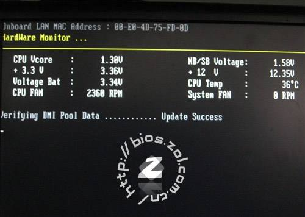

# 1.Linux
- Linux 是一套免费使用和自由传播的类Unix操作系统
- 在服务器端领域和嵌入式领域有非常广泛的应用
# 2.版本
分为内核版本和发行版本
- [kernel](https://www.kernel.org/)
- 各个厂商会制作自己的发行版本
    - redhat
    - CentOS
    - ubuntu
    - fedora
# 3. Linux与Windows的不同
- Linux严格区分大小写
- Linux中所有的内容以文件形式保存，包括硬件、用户和文件。
- Linux不靠扩展名区分文件类型，是靠权限来区分，但是有一些约定的扩展名，是给管理员看的
    - 压缩包 .gz   .bz2   .tar.bz2    .tgz
    - 二进制文件  .rpm
    - 网页文件 .html  .php
    - 脚本文件 .sh
    - 配置文件 .conf
- Windows 下的程序不能直接在Linux中安装和运行
- Linux更多使用字符界面
    - 占用的系统资源更少
    - 减少了出错和被攻击的可能性，会让系统更稳定
# 4. VMware安装
## 4.1 什么是虚拟机
- 是一个虚拟PC的软件
- 可以在现有的操作系统上虚拟出一个新的硬件环境
- 相当于模拟出一台新的个人电脑
- 可以实现在一台机器上正真同时运行的两个独立的操作系统
- [VMware](http://www.vmware.com/)
## 4.2 虚拟机的主要特点
- 不需要分区或重新开机就能在一台PC上使用两种以上的操作系统
- 本机系统可以与虚拟机系统网络通信
- 可以设定并且随时修改虚拟机操作的硬件环境
- 系统快照可以方便备份和回滚
## 4.3 建议VMWare配置
- CPU 建议主频1GHz以上
- 内存 建议2GB以上
- 硬盘 建议分区空闲空间8GB以上
## 4.4 虚拟机的安装
- [VMware8.0](http://www.vmware.com/)
- [4m2g](https://pan.baidu.com/s/1kliOXFDYq4bp8jPgYs-pBg)
# 5.linux 系统启动
## 5.1 BIOS
- 计算机通电后，第一件事就是读取刷入ROM芯片的开机程序，这个程序叫做基本输入输出系统（Basic Input/Output System）

## 5.2 硬件自检
- BIOS程序首先检查，计算机硬件能否满足运行的基本条件，这叫做“硬件自检”（Power-On Self-Test）
- 如果硬件出现问题，主板会发出不同含义的蜂鸣，启动中止。如果没有问题，屏幕就会显示出CPU、内存、硬盘等信息。

## 5.3 启动顺序
- 硬件自检完成后，BIOS把控制权转交给下一阶段的启动程序。
- 这时，BIOS需要知道 下一阶段的启动程序 具体存放在哪一个设备
- BIOS需要有一个外部存储设备的排序，排在前面的设备就是优先转交控制权的设备。这种排序叫做“启动顺序”(Boot Sequence)
- BIOS按照“启动顺序”，把控制权转交给排在第一位的存储设备

## 5.4 主引导记录
- 计算机读取该设备的第一个扇区，也就是读取最前面的 512个字节。如果这512个字节的最后两个字节是 0x55 和 0xAA,表明这个设备可以用于启动；如果不是，表明设备不能用于启动，控制权于是被转交给 启动顺序 中的下一个设备
- 这最前面的512个字节，就叫做 主引导记录 （Master boot record, 缩写为MBR）

## 5.5 主引导记录的结构
- 主引导记录只有512个字节。它的主要作用是告诉计算机到硬盘的哪一个位置去找操作系统。
    - （1）第1-446字节：是用来记录系统的启动信息的，调用操作系统的机器码
    - （2）第447-510字节（64个字节）：分区表（Partition table）,分区表的作用，是将硬盘分成若干区
    - （3）第511-512字节：主引导记录签名(0x55和0xAA)

## 5.6 分区表
- 磁盘分区是使用分区编辑器在磁盘上划分几个逻辑部分
- 磁盘一旦划分成多个分区，不同类型的目录与文件可以存储进不同的分区内
- 主引导记录因此必须知道将控制权转交给哪个区
- 分区表的长度只有64个字节，里面又分成四项，每项16个字节。所以，一个硬盘最多只能分四个一级分区，又叫做 主分区。
    - （1）第1个字节：如果为0x80,就表示该主分区是激活分区，控制权要转交给这个分区。四个分区里面只有一个是激活的。
    - （2）第2-4个字节：主分区第一个扇区的物理位置（柱面(Cylinder)、磁头（Heads）、扇区号(Sector)等等）
    - （3）第5个字节：主分区类型，比如FAT32、NTFS等
    - （4）第6-8个字节：主分区最后一个扇区的物理位置
    - （5）第9-12个字节：主分区第一个扇区的逻辑地址
    - （6）第13-16字节：主分区的扇区总数

### 5.6.1 扇区
- 扇区是硬盘存储上的概念，机械硬盘的内部是金属盘片，将圆形的盘片划分成若干个扇形区域，这就是扇区，若干个扇区就组成整个盘片
- 扇区是硬盘上最小的读写单位，这个是硬盘决定的，不是操作系统决定的
- 对现在的硬盘来说，逻辑扇区的大小等于物理扇区的大小，所以也并没有严格区分物理扇区和逻辑扇区
#### 5.6.1.1 物理扇区
- 物理扇区就是底层硬件意义上的扇区
#### 5.6.1.2 逻辑扇区
- 而在物理扇区之上，操作系统划分的逻辑扇区，是为了方便操作系统读取写入硬盘数据而设置的，其大小与具体地址，都可以通过一定的公式与物理地址对应
- 同时如果出现的坏扇区，系统可以通过逻辑扇区，将物理上的坏扇区地址，重新定位到硬盘上备用的好扇区上，这样也就延长了硬盘的使用寿命

## 5.7 硬盘启动
- 计算机的控制权要转交给硬盘的某个分区了
- 四个主分区里面，只有一个是激活的。计算机会读取激活分区的第一个扇区，叫做“卷引导记录”（Volume boot record,缩写为VBR）
## 5.8 操作系统
- 控制权转交给操作系统后，操作系统的内核首先被载入内存。
- 以Linux为例，先载入/boot目录下面的kernel。内核加载成功后，第一个运行的程序是/sbin/init。它根据配置文件（Debian系统是/etc/initab）产生init进程。这时Linux启动后的第一个进程，pid进程编号为1，其它进程都是它的后代
- 然后, init线程加载系统的各个模块，比如窗口程序和网络程序，直至执行/bin/login程序，跳出登录界面，等待用户输入用户名和密码。
# 6.硬件设备文件名
- 只要插入硬盘，Linux会自动检测和分配名称
- 一个硬盘可以分成多个分区，每个分区都会有一个系统分配的名称
- 第一块SCSI硬盘名称叫做sda,它的第一个分区叫sda1

| 硬件 | 设备文件名 |
| --- | --- |
| IDE硬盘 | /dev/hd[a-d] |
| SCSI/SATA/USB硬盘 | /dev/sd[a-p] |
| 光驱 | /dev/cdrom或/dev/hdc |
| 软盘 | /dev/fd[0-1] |
| 打印机(25针) | /dev/lp[0-2] |
| 打印机(USB) | /dev/usb/lp[0-15] |
| 鼠标 | /dev/mouse |
## 6.1 IDE硬盘接口

## 6.2 SCSI硬盘接口

## 6.3 SATA硬盘接口

# 7.分区

- 磁盘分区是使用分区编辑器在磁盘上划分几个逻辑部分
- 磁盘一旦划分成多个分区，不同类的目录与文件可以存储进不同的分区内
- 分区表的长度只有64个字节，里面又分成四项，每项16个字节。所以，一个硬盘最多只能分四个一级分区，又叫做 主分区
## 7.1 扩展分区
- 随着硬盘越来越大，四个主分区已经不够多了，需要更多的分区，但是，分区表只有四项，因此规定有且仅有一个区可以被定义成扩展分区（Extended partition）
- 所谓扩展分区，就是指这个区里面又分成多个区。这种分区里面的分区，就叫做逻辑分区(logical partition)
- 为了突破4个分区的限制，就取出一个分区作为 扩展分区
    - 扩展分区最多只能有1个
    - 主分区加扩展分区最多有4个
    - 不能写入数据，只能包含逻辑分区，逻辑分区最多是23个
# 8.格式化
- 格式化是指根据用户选定的文件系统(如FAT16(2G),FAT32(4G)、NTFS、EXT2、EXT3、EXT4)对分区进行划分
- 目的是为了更好的写入和读取数据
- 主要把整个分区切分成等大小的数据库，每个数据块是4KB，10K需要使用2个半的数据块。是存放文件的最小空间。
- 微软操作系统（DOS、WINDOWS等）中磁盘文件存储管理的最小单位叫做 簇
- 簇(cluster)的本意就是一组，即一组扇区（一个磁道可以分割成若干个大小相等的圆弧，叫扇区）的意思。因为扇区的单位太小，因此把它捆在一起，组成一个更大的单位簇更方便进行灵活管理
- 在分区中划出一片用于存放文件分配表，目录表等用户文件管理的磁盘空间。
    - ID
    - 修改时间
    - 权限
    - 数据块位置
- 格式化会清空数据

# 9.挂载点
- 为了让Linux系统中可以访问这些分区，需要把这些分区挂载到对应的目录上
- 在Linux中是把目录称为 挂载点
- 把目录和分区链接在一起的过程称为 挂载
- / 为根目录，必须挂载到一个分区上，默认所有子目录都会写入这个分区
- 同一级目录下面的所有子目录可以有自己的独立存储空间
- 必须有的分区
    - / 根分区
    - swap分区（交换分区，虚拟内存，一般为内存的2倍，不要超过2G）
- 推荐分区
    - /boot(启动分区，200M)单独分区，避免分区写满造成系统无法启动
## 9.1 挂载示例
- /dev/sd2 挂载到了 / 目录上，也就是说向 / 目录下在写文件就是往 /dev/sd2 分区里写文件
- /dev/sd1 挂载到了 /boot 目录上，也就是说向 /boot目录下在写文件就是往 /dev/sd1 分区里写文件
- /dev/sd3 挂载到了 /home 目录上，也就是说向 /home 目录下在写文件就是往 /dev/sd3 分区里写文件

# 10.虚拟机使用
## 10.1 新建虚拟机
- i. Create a New Virtual Machine 开始新建虚拟机向导
- ii. 我以后再安装操作系统
- iii. Linux CentOS 32位
- iv. 20G硬盘
## 10.2 网络连接
- VMware提供了三种工作模式，它们是 bridged(桥接模式)、NAT(网络地址转换模式)和host-only(主机模式)
### 10.2.1 bridged(桥接模式)
- 在这种模式下，VMware虚拟出来的操作系统就像是局域网中的一台独立的主机，它可以访问网内任何一台机器。
- 在桥接模式下，你需要手工为虚拟系统配置IP地址、子网掩码、而且还要和宿主机器处于同一网段，这样虚拟系统才能和宿主机器进行通信
- 如果你想利用VMware在局域网内新建一个虚拟服务器，为局域网用户提供网络服务，就应该选择桥接模式
- bridged模式下的 VMnet0 虚拟网络不提供DHCP服务
- vmnet0,实际上就是一个虚拟的网桥，这个网桥有若干个端口，一个端口用于连接你的Host,一个端口用于连接你的虚拟机，他们的位置是对等的，谁也不是谁的网关

### 10.2.2 host-only(主机模式)
- 所有的虚拟系统是可以相互通信的，但虚拟系统和真实的网络是被隔离开的
- 虚拟系统和宿主机器系统是可以相互通信的
- 虚拟系统的TCP/IP配置信息（如IP地址、网关地址、DNS服务器等），都是由VMnet1(host-only)虚拟网络的DHCP服务器来动态分配的，IP地址是随机生成的

### 10.2.3 NAT(网络地址转换模式)
- 使用NAT模式，就是让虚拟系统借助NAT（网络地址转换）功能，通过宿主机器所在的网络来访问公网
- 使用NAT模式可以实现在虚拟系统里访问互联网。NAT模式下的虚拟系统的TCP/IP配置信息是由VMnet8(NAT)虚拟网络的DHCP服务器提供的，无法进行手工修改
- 使用VMnet8虚拟交换机，此时虚拟机可以通过主机单向访问网络上的其他工作站，其他工作站不能访问虚拟机

## 10.3 使用快照
- 可以使用快照
- 在合适的时间恢复快照
## 10.4 克隆
从当前的虚拟机克隆出一个虚拟机
- 可以克隆当前或者快照
- 克隆方式可以选择链接克隆或者完整克隆